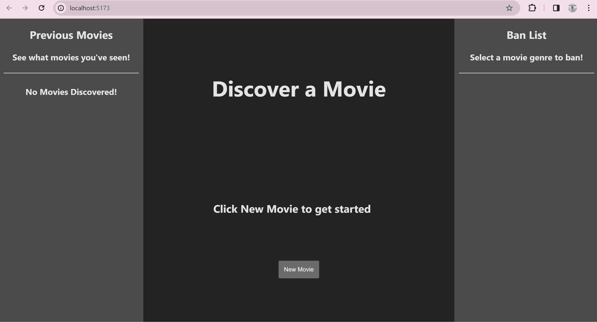

# Web Development Project 4 - FlickFinder

Submitted by: Lucas Umberger

**This web app was created to let people explore movies they're interested in, without having to go over the stuff the already know. FlickFinder lets you discover movies with the click of a button. The site allows the user to click a New Movie button to display movie information and movie poster aligning with the genres the user is interested in exploring. The user can then filter by movie genre to get more and more specific results.**

Language: JavaScript, HTML, CSS

Framework: React

API: TMDB [Documentation](https://themoviedb.org/?language=en-US)

Time spent: **11** hours in total

## User Features

The following **required** functionality is completed:

- [x] **Clicking a button creates a new API fetch request and displays at least three attributes from the returned JSON data**
- [x] **Only one item/API call is viewable at a time**
- [x] **API calls appear random to the user**
- [x] **At least one image is displayed per API call**
- [x] **Clicking on a displayed value for one attribute adds it to a displayed ban list**
- [x] **Attributes on the ban list prevent further images/API results with that attribute from being displayed**

The following **optional** features are implemented:

- [x] Users can see a stored history of their previously viewed items from their session

The following **additional** features are implemented:

* [x] Ban list attributes can be taken off of list in session

## Video Walkthrough

Here's a walkthrough of implemented user features:

<!-- Replace this with whatever GIF tool you used! -->
GIF created with ScreenToGif
<!-- Recommended tools:
[Kap](https://getkap.co/) for macOS
[ScreenToGif](https://www.screentogif.com/) for Windows
[peek](https://github.com/phw/peek) for Linux. -->

## Challenges

 - Accessing the API in the way that I wanted to took up a lot of my time initially. When I was trying to get the information to show I was getting the same results over and over again so I had to implement a random number finder to get a random entry every time. I also struggled with incorperating the ban list because I did not realize the API I was using had a without_genre filter, so I was initally searching new queries each time for the banned genres.

## License

    Copyright [yyyy] [name of copyright owner]

    Licensed under the Apache License, Version 2.0 (the "License");
    you may not use this file except in compliance with the License.
    You may obtain a copy of the License at

        http://www.apache.org/licenses/LICENSE-2.0

    Unless required by applicable law or agreed to in writing, software
    distributed under the License is distributed on an "AS IS" BASIS,
    WITHOUT WARRANTIES OR CONDITIONS OF ANY KIND, either express or implied.
    See the License for the specific language governing permissions and
    limitations under the License.
